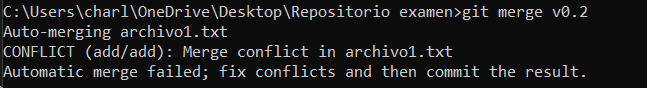

# Comandos para el examen 

## Iniciar repositorio
```
git init
git add .
git commit -m"commit inicial"
```


## Ignorar archivos
```
Crear archivo .gitignore y poner: 
privado/
privado.txt
```


## Crear tag
* Para ver el nombre del commit:
```
git log --oneline
```
* Crear el tag:
```
git tag -a v0.1 -m"Primer Tag" dc72066
```


## Creacion de ramas
* Crear rama y posicionarte en ella:
```
git checkout -b "v0.2"
```


## Merge directo
* Posicionarse en la rama master
```
git checkout master
```
* Hacer un merge de la rama v0.2 en la rama master. 
```
git merge v0.2
```


## Merge con conflicto 
* En la rama master poner Hola en el fichero 1.txt y hacer commit. 
```
//Modificar el archivo
git add archivo1.txt
git commit -m"Cambio"
```
* Posicionarse en la rama v0.2 y poner Adios en el archivo "1.txt" y hacer commit. 
```
git checkout v0.2
//Modificar el archivo
```
* Posicionarse de nuevo en la rama master y hacer un merge con la rama v0.2
``` 
git checkout master
git merge v0.2
```


# Listado de ramas 
* Listar las ramas con merge y las ramas sin merge.
```
git branch -v
```


## Arreglar conflicto 
* Arreglar el conflicto anterior y hacer un commit. 
```
//Aceptar el primer cambio "Hola"
git add archivo1.txt
git commit -m"Solucion de conflicto" 
```
## Borrar rama 
* Crear un tag v0.2 
```
git tag -a v0.2 -m"v0.2" 3cbd0d6
```
* Borrar la rama v0.2 
```
git merge -d "v0.2"
```

## Listado de cambios 
* Listar los distintos commits con sus ramas y sus tags.
```
git log --graph --all --oneline
```


# Parte 2 

## Cuenta de GitHub 
* Poner una foto en tu perfil de GitHub. 
* Poner el doble factor de autentificación en tu cuenta de GitHub. 
* Añadir (si no lo has hecho aun) la clave pública (ssh) que se corresponde a tu equipo. 
 
## Uso social de GitHub 
* Preguntar los nombres de usuario de GitHub de tus compañeros de clase, búscalos, y síguelos. 
* Seguir los repositorios PM1 del resto de tus compañeros. 
* Añadir una estrella a los repositorios PM1 del resto de tus compañeros. 
 
## Crear una tabla 
* Crear una tabla de este estilo en el fichero README.md con la información de 3 de tus compañeros de clase: 
| Nombre | Usuario |
|--------|---------|
|Juan    |JuanNeiraJaime|
|Martin  |MartinCabrera137|
|Luis    |LuisContreras1299|

##Colaboradores 
Ponerme como colaborador del repositorio PM1 *mi usuario: jmav94 
 

## Crear una organización 
* Crear una organización llamada PM1 -tunombredeusuariodegithub 
## Crear equipos 
* Crear 2 equipos en la organización PM1-tunombredeusuariodegithub, uno llamado administradores con más permisos y otro colaboradores con menos permisos. 
* Meterme a mí (jmav94) y a 2 de tus compañeros de clase en el equipo administradores. 
* Meterme a mí y a otros 2 de tus compañeros de clase en el equipo colaboradores. 

## Crear un index.html 
* Crear un index.html que se pueda ver como página web en la organización. 

##Crear Pull-requests 
* Hacer 2 forks de 2 repositorios PM1-tunombredeusuariodegithub.github.io de 2 organizaciones de las que no seas ni administrador ni colaborador. 
* Crear una rama en cada fork. 
* En cada rama modificar el archivo index.html añadiendo tu nombre. 
* Con cada rama hacer un pull-request. 
 

## Gestionar Pull-requests 
* Aceptar los pull-request que lleguen a los repositorios de tu organización. 
